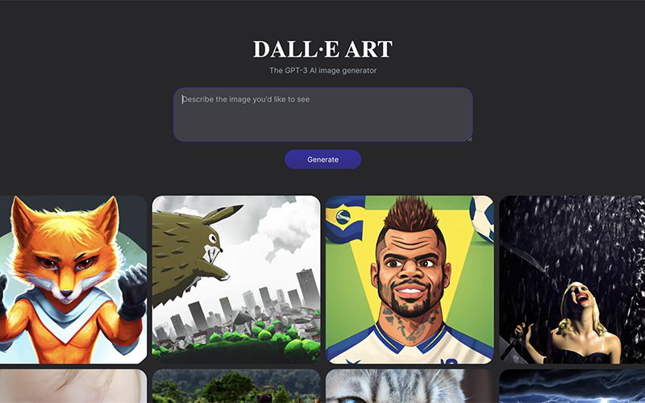

# DALL·E ART

Generate an image based on a text prompt using DALL·E OpenAI API.

- Front End built with React, Typescript, Vite, Styled Component, and React Hook Form
- Back End built with Node, Express, Docker, Typescript, Postgres and Prisma
- Model, Service, Controller and OOP architecture

 

<a href="https://dall-eart.vercel.app">Website</a>
 
 

